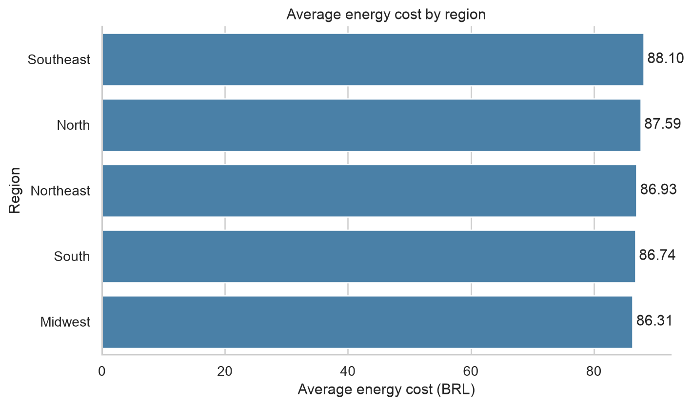

# Energy Cost Analysis by Customer Segment

This reproducible analysis explores patterns in a supplied energy-cost dataset containing 5,000 customer records.

## Questions addressed

- How do supplied energy costs vary by customer type and region?
- How do building size and occupant count relate to the recorded cost?
- Is the dataset suitable for descriptive portfolio analysis?

## Findings

- The dataset contains 5,000 records, with no missing values or exact duplicate rows.
- Mean energy cost is BRL 87.15 for residential records and BRL 86.35 for commercial records.
- The Southeast has the highest mean regional cost (BRL 88.10); the Midwest has the lowest (BRL 86.31).
- Occupant count has a stronger exploratory correlation with cost (0.536) than building size (0.196).

## Repository structure

- `notebooks/energy_consumption_analysis.ipynb`: executed, reproducible analysis.
- `data/energy_consumption.csv`: supplied source data.
- `images/`: notebook-generated figures.

## Important limitation

The source does not include a date, energy-usage readings, tariffs, weather, or building-efficiency measures. Results are descriptive only and cannot establish what causes energy costs to change.

## Tools

Python, pandas, matplotlib, and seaborn.
